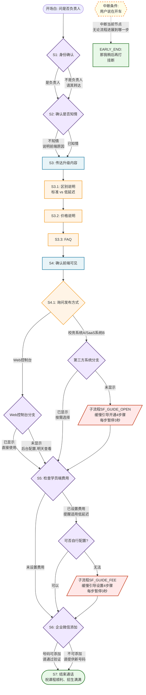

# 示例 2 嵌套 Flow DAG 可视化

> 用于配合 `example_2_flow_dag.json` 验证流程理解

## 完整流程图

## 流程统计

| 类型 | 数量 |
|---|---|
| 主要 step | 7 |
| 嵌套子 step | 5 (S3.1, S3.2, S3.3, S4.1, S5.SUB_CHECK) |
| 分支判定点 | 7 (S1, S2, S4.1, S4.1.WEB, S4.1.THIRD_PARTY, S5, S5.SUB_CHECK, S6) |
| 子流程 | 2 (SF_GUIDE_OPEN, SF_GUIDE_FEE，各含4个有序子步骤) |
| 终止节点 | 2 (S7正常结束 + EARLY_END_DRIVING提前结束) |
| 最大嵌套深度 | 3 (S4 → S4.1 → S4.1.THIRD_PARTY) |

## 这张图揭示的真实复杂度

对比示例 1 的 4 个线性 step，示例 2 实际包含：

1. **7 个主步骤**，其中 4 个含分支
2. **9 个分支决策点**（每个 if/else 算 2 个分支）
3. **2 个子流程**，每个 4 个有序步骤，且有时序约束
4. **3 层嵌套**：S4 → S4.1 → S4.1.THIRD_PARTY → SF_GUIDE_OPEN

**这意味着**：
- 一次完整对话至少要触发 7 个 step 节点
- 完整覆盖所有分支需要至少 8 通对话（多种 persona）
- 子流程必须分轮发送（不能一轮说完4步），这是新的约束类型
